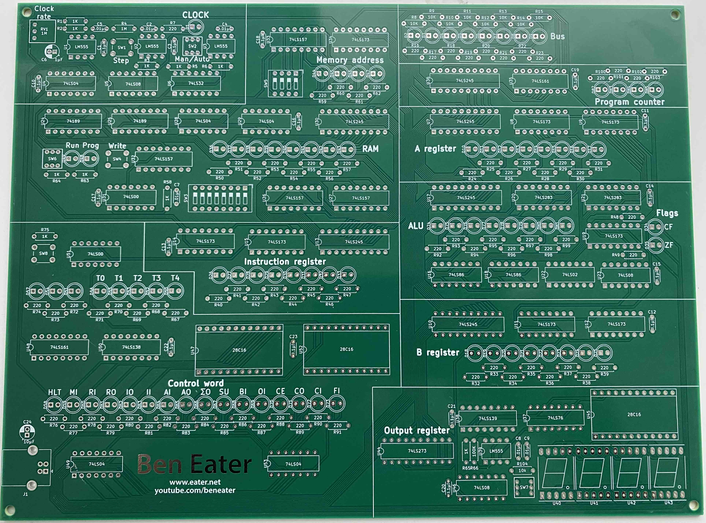
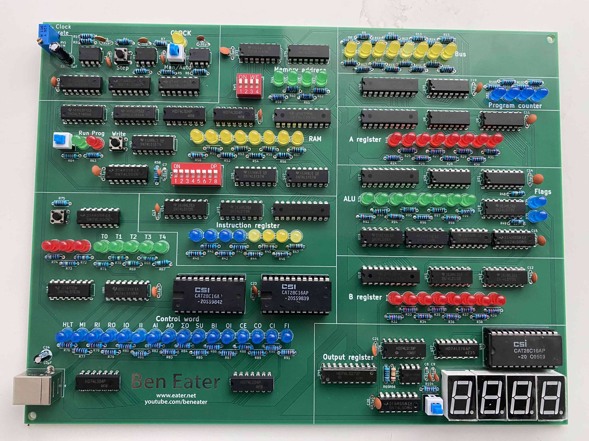

# Ben Eater - 8bit CPU

Build an 8-bit CPU from scratch
This tutorial walks through building a fully programmable 8-bit computer from simple logic gates on breadboards. Included are parts lists, sources, and schematics to make it easier to follow along or even build your own!

Website: [https://eater.net/8bit](https://eater.net/8bit)

## Sponsorship

This project is kindly sponsored by [PCBWay](https://pcbway.com).
PCBWay specializes in manufacturing high-quality PCBs and makes them affordable to hobbyist and professionals alike.

The range of services they offer include PCB prototyping, assembly, instant quotes for your order, a verification process by a team
of experts and an easy to use, hassle-free order process.

I'm grateful to PCBWay for the support in creating this project.

## PCB

## Soldered

